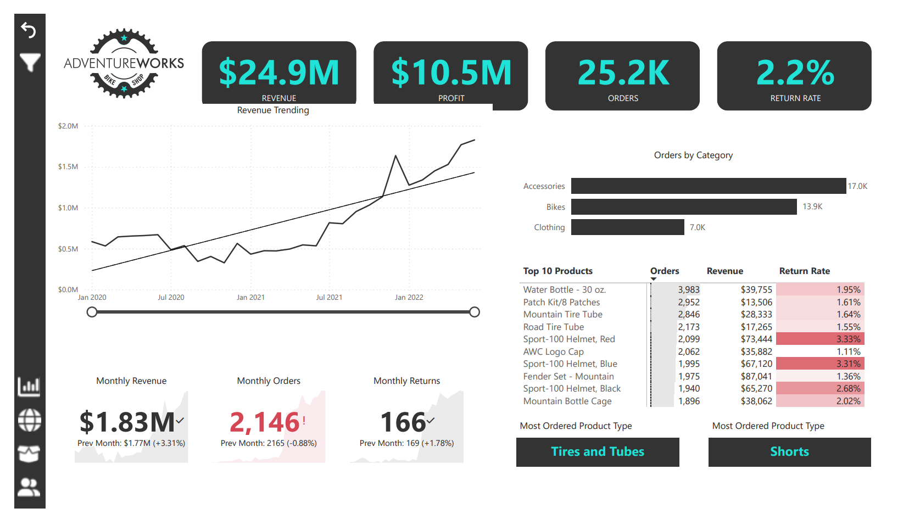
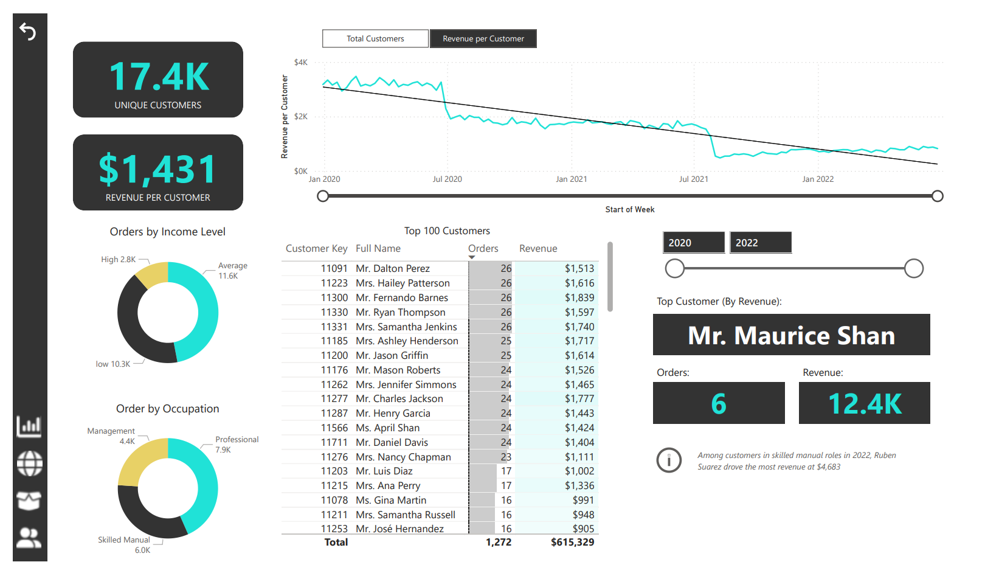
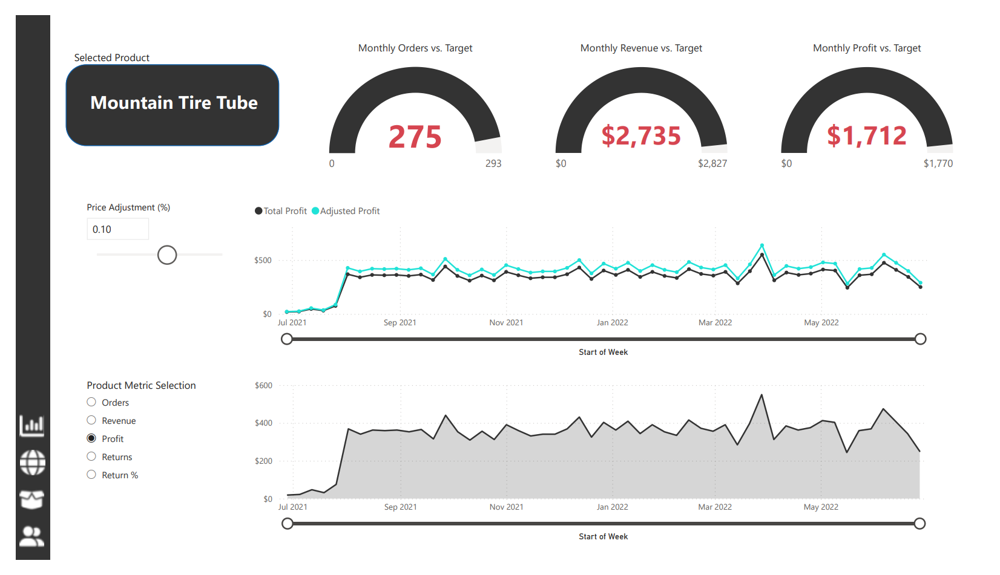
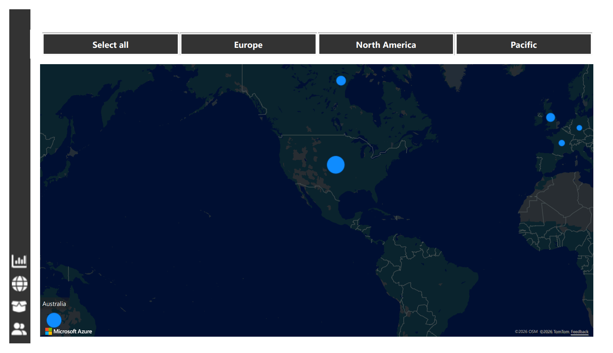

# AdventureWorks Sales Performance Dashboard

## Snapshot

**Business scenario:** Simulated business intelligence case study using AdventureWorks sales data.

**Business question:** How can a retail business monitor sales performance, identify commercial opportunities, and support better management decision-making?

**Dashboard focus:** Sales performance, customer insights, product performance, regional activity, and DAX-based scenario modelling.

**Tools:** Power BI, DAX, Power Query, Excel

**Methods:** Data modelling, KPI design, DAX measures, interactive dashboarding, sales trend analysis, customer analysis, product analysis, regional mapping, and what-if scenario modelling

**Output:** Interactive Power BI dashboard, dashboard screenshots, and business intelligence case study README

---

## About This Project

This project is based on a simulated business intelligence brief using AdventureWorks sales data.

AdventureWorks is treated as a fictional retail business that needs better visibility over commercial performance. The goal was to design an interactive Power BI dashboard that helps managers monitor revenue, profit, orders, returns, customer behaviour, product performance, and regional sales activity.

The project also includes a DAX-based what-if analysis page that allows users to test how price adjustments could affect product-level revenue, profit, and order performance.

This project demonstrates how Power BI can be used not only for reporting, but also for interactive business scenario analysis.

---

## Transparency Note

This is a portfolio project based on a simulated business intelligence scenario using AdventureWorks sales data.

It is not presented as a real client engagement. The purpose is to demonstrate Power BI dashboarding, data modelling, DAX, sales analytics, commercial reporting, and scenario modelling skills.

---

## Business Scenario

AdventureWorks has sales data across products, customers, dates, and regions, but business users need a clearer way to understand performance.

The simulated stakeholder brief was to build an interactive dashboard that could help management answer:

* How are revenue, profit, order volume, and returns performing?
* Which product categories and products are driving sales?
* Which customers and customer groups contribute most to revenue?
* Which regions or markets are showing stronger activity?
* Which products have higher return rates?
* How would product-level price adjustments affect commercial performance?
* How can leadership monitor business performance quickly through interactive KPIs?

The dashboard was designed to make these insights accessible through visuals, slicers, KPI cards, maps, and DAX-driven scenario analysis.

---

## Why This Project Matters

Business teams often need dashboards that are not only visually clear, but also commercially useful. A good dashboard should help users understand what is happening, where performance is changing, and which areas require action.

This project demonstrates business intelligence skills relevant to Business Analyst, BI Analyst, Data Analyst, and RevOps Analyst roles.

It shows the ability to:

* Understand business reporting needs
* Prepare and model sales data
* Build KPI measures using DAX
* Design interactive Power BI dashboards
* Analyse customer, product, and regional performance
* Use what-if parameters for scenario modelling
* Communicate insights visually for business users
* Support commercial decision-making through reporting

---

## What I Built

The Power BI dashboard was designed to provide a management-level view of sales performance.

The dashboard includes:

* Executive KPI overview
* Revenue, profit, orders, and return-rate tracking
* Revenue trend analysis
* Orders by product category
* Top product performance table
* Monthly revenue, orders, and returns indicators
* Customer analysis page
* Customer segmentation by income level and occupation
* Top customer analysis
* Product-level scenario modelling page
* DAX-based price adjustment simulation
* Product performance against targets
* Regional performance map
* Interactive navigation and filters

---

## Key Dashboard Metrics

The dashboard overview highlights:

* **$24.9M** revenue
* **$10.5M** profit
* **25.2K** orders
* **2.2%** return rate
* **$1.83M** monthly revenue
* **2,146** monthly orders
* **166** monthly returns

The customer page highlights:

* **17.4K** unique customers
* **$1,431** revenue per customer
* Top customer and revenue contribution views
* Customer breakdown by income level and occupation

These metrics give stakeholders a quick view of overall sales health, customer value, and commercial performance.

---

## Analytical Approach

### 1. Data Preparation

The dashboard was built using AdventureWorks sales data. Power Query was used to prepare and shape the data before dashboard development.

The preparation process included:

* Importing relevant sales, product, customer, date, and geography data
* Cleaning and shaping tables for reporting
* Checking relationships between tables
* Preparing data fields for dashboard visuals and measures

### 2. Data Modelling

A structured Power BI data model was used to connect the main business entities:

* Sales
* Products
* Customers
* Dates
* Regions or territories
* Returns

This allowed the dashboard to support interactive filtering across customer, product, geography, and time dimensions.

### 3. DAX Measures

DAX was used to create business measures and KPIs.

Measure areas included:

* Revenue
* Profit
* Orders
* Return rate
* Monthly revenue
* Monthly orders
* Monthly returns
* Revenue per customer
* Product-level performance
* Adjusted profit or revenue under price scenarios

### 4. Dashboard Design

The dashboard was designed around business questions rather than visuals alone.

The layout focuses on:

* Clear KPI cards
* Trend visibility
* Product and category performance
* Customer contribution
* Regional comparison
* Interactive scenario analysis
* Simple navigation for business users

---

## Key Dashboard Features

### 1. Executive Sales Overview

The overview page provides high-level KPIs for revenue, profit, orders, and return rate.

It also includes revenue trend analysis, orders by category, top product performance, and monthly performance indicators.

This page helps managers quickly understand overall commercial performance.

### 2. Customer Insights

The customer page highlights unique customers, revenue per customer, customer composition, and top customer performance.

It helps stakeholders understand:

* Which customers contribute most to revenue
* How customer groups differ by income level and occupation
* Whether customer value is increasing or declining over time
* Which customer segments may require retention or growth focus

### 3. Product Scenario Analysis

The product page includes a DAX-based what-if analysis feature.

This allows users to simulate how product-level price adjustments affect revenue, profit, and order performance.

The page helps answer questions such as:

* How would a price increase or decrease affect profit?
* Is the selected product above or below target?
* How does adjusted profit compare with current profit?
* Which products may be suitable for pricing review?
* How can managers test pricing scenarios before making decisions?

This feature demonstrates the use of DAX not only for KPI reporting, but also for interactive commercial scenario modelling.

### 4. Regional Performance

The regional page uses a map-based view to show sales activity across geographic regions.

It helps decision-makers compare market activity and identify stronger or weaker regional areas.

---

## Business Value

This dashboard provides value by helping business users:

* Monitor sales performance in one place
* Track revenue, profit, orders, and returns
* Identify high-performing products and categories
* Understand customer contribution to revenue
* Compare customer behaviour across groups
* Review regional sales activity
* Test product-level pricing scenarios
* Explore performance through interactive filtering
* Turn raw sales data into a usable management reporting tool

The project demonstrates how BI reporting can support commercial performance monitoring and data-informed decision-making.

---

## Key Visuals

### Dashboard Overview



**Business takeaway:** Provides a management-level overview of revenue, profit, orders, return rate, sales trends, category performance, and top products, helping stakeholders monitor overall commercial performance quickly.

### Customer Insights



**Business takeaway:** Highlights customer value through metrics such as unique customers and revenue per customer, while also showing customer composition by income level and occupation to support customer-focused decision-making.

### Product Scenario Analysis



**Business takeaway:** Uses DAX-based what-if analysis to simulate how price adjustments affect product-level revenue, profit, and order performance, supporting commercial scenario planning and pricing decisions.

### Regional Performance



**Business takeaway:** Visualises sales activity across global regions, helping decision-makers compare market presence and identify stronger or weaker geographic areas.

---

## Dashboard File

The Power BI file is available in the `dashboard/` folder:

[View Power BI Dashboard File](dashboard/AdventureWorks-Report.pbix)

Note: GitHub may not preview `.pbix` files directly. Download the file and open it in Microsoft Power BI Desktop to interact with the dashboard.

---

## Repository Structure

```text
dashboard/   Power BI dashboard file
visuals/     Dashboard screenshots and supporting images
data/        Data notes or source information
README.md    Project case study documentation
```

---

## Project Status

Completed as part of my Business Analytics portfolio.

